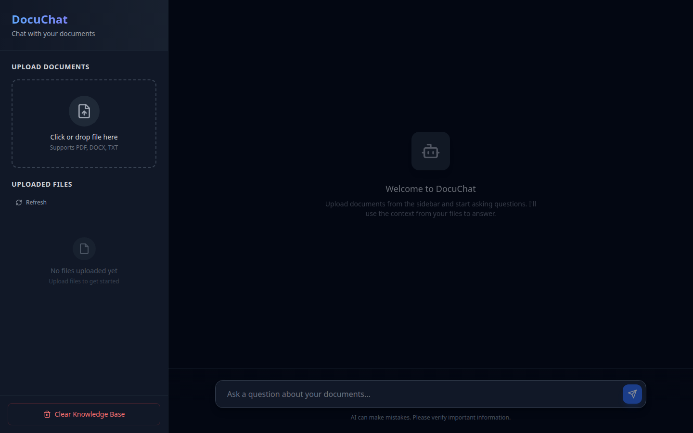

# DocuChat

A Retrieval-Augmented Generation (RAG) application that allows you to upload documents and query them using natural language. Built with FastAPI, React, LlamaIndex, and ChromaDB.

## Preview



*Empty-state DocuChat: upload PDF, DOCX, or TXT files in the sidebar, then ask questions in the chat. Screenshot from the Vite frontend at http://localhost:5173. Full answers need an LLM provider (`LLM_PROVIDER` plus an API key, or LM Studio / Ollama).*

```bash
# Frontend only (UI)
cd frontend && npm install && npm run dev

# Full stack (Docker)
cp .env.example .env   # set LLM_PROVIDER + keys as needed
docker-compose up -d
# Frontend http://localhost:5173 · API docs http://localhost:8000/docs
```

## Overview

DocuChat enables you to:
- Upload PDF documents
- Automatically ingest and index documents into a vector database
- Query your documents using natural language
- Get contextual answers based on your uploaded documents

## Architecture

- **Backend**: FastAPI with LlamaIndex for RAG, ChromaDB for vector storage
- **Frontend**: React + TypeScript + Vite with TailwindCSS
- **LLM**: LM Studio, Ollama, OpenAI, or Gemini (configurable)
- **Embeddings**: HuggingFace BAAI/bge-small-en-v1.5

## Prerequisites

- Docker and Docker Compose
- **LLM Provider** (choose one):
  - **LM Studio**: Running on port 1234 (default: `http://localhost:1234/v1`)
  - **Ollama**: Running on port 11434 (default: `http://localhost:11434`)
- Python 3.8+ (for local development)
- Node.js 18+ (for local frontend development)

## Quick Start

### Using Docker Compose (Recommended)

1. **Set up environment variables**:
```bash
# Copy the example environment file
cp .env.example .env

# Edit .env and add your API keys
# For OpenAI: Get your key from https://platform.openai.com/api-keys
# For Gemini: Get your key from https://makersuite.google.com/app/apikey
```

2. **Start LM Studio** on your host machine (port 1234) if using `lm_studio` provider

3. **Start all services**:
```bash
docker-compose up -d
```

3. **Access the application**:
   - Frontend: http://localhost:5173
   - Backend API: http://localhost:8000
   - ChromaDB: http://localhost:8001

4. **View API documentation**:
   - Swagger UI: http://localhost:8000/docs
   - ReDoc: http://localhost:8000/redoc

### Local Development

#### Backend Setup

```bash
cd backend
python -m venv venv
source venv/bin/activate  # On Windows: venv\Scripts\activate
pip install -r requirements.txt
uvicorn app.main:app --reload --port 8000
```

#### Frontend Setup

```bash
cd frontend
npm install
npm run dev
```

## LLM Configuration

DocuChat supports four LLM providers: **LM Studio**, **Ollama**, **OpenAI**, and **Gemini**. You can switch between them using the `LLM_PROVIDER` environment variable in your `.env` file.

### Using LM Studio

1. **Install and start LM Studio**:
   - Download from [lmstudio.ai](https://lmstudio.ai)
   - Start LM Studio and load a model
   - Ensure the local server is running on port 1234

2. **Configure in `.env` file**:
   ```bash
   LLM_PROVIDER=lm_studio
   ```
   
   Note: LM Studio configuration (API base, model) is set in `docker-compose.yml` and doesn't require API keys.
     - LM_STUDIO_MODEL=gpt-3.5-turbo
   ```

3. **Start the application**:
   ```bash
   docker-compose up -d
   ```

### Using Ollama

1. **Install and start Ollama**:
   ```bash
   # Install Ollama (macOS/Linux)
   curl -fsSL https://ollama.ai/install.sh | sh
   
   # Or download from https://ollama.ai
   ```

2. **Pull a model** (choose one):
   ```bash
   ollama pull llama2          # Llama 2 (7B parameters)
   ollama pull mistral         # Mistral (7B parameters)
   ollama pull codellama       # Code Llama (for code-related queries)
   ollama pull llama2:13b      # Larger Llama 2 model
   ```

3. **Configure in `.env` file**:
   ```bash
   LLM_PROVIDER=ollama
   ```
   
   Note: Ollama configuration (base URL, model) is set in `docker-compose.yml` and can be overridden in `.env` if needed.

4. **Start the application**:
   ```bash
   docker-compose up -d
   ```

### Using OpenAI (Official API)

1. **Get an API key**:
   - Sign up at [OpenAI Platform](https://platform.openai.com)
   - Navigate to [API Keys](https://platform.openai.com/api-keys)
   - Create a new secret key

2. **Configure in `.env` file**:
   ```bash
   LLM_PROVIDER=openai
   OPENAI_API_KEY=your-api-key-here
   OPENAI_MODEL=gpt-3.5-turbo
   ```
   
   **Available models:**
   - `gpt-3.5-turbo` - Fast and cost-effective (default)
   - `gpt-4` - More capable but slower and more expensive
   - `gpt-4-turbo-preview` - Latest GPT-4 with improved performance

3. **Start the application**:
   ```bash
   docker-compose up -d
   ```

### Using Google Gemini

1. **Get an API key**:
   - Go to [Google AI Studio](https://makersuite.google.com/app/apikey)
   - Sign in with your Google account
   - Create a new API key

2. **Configure in `.env` file**:
   ```bash
   LLM_PROVIDER=gemini
   GEMINI_API_KEY=your-api-key-here
   GEMINI_MODEL=models/gemini-2.5-flash
   ```
   
   **Available models:**
   - `models/gemini-2.5-flash` - Latest fast model (recommended, default)
   - `models/gemini-2.5-pro` - Latest high-quality model
   - `models/gemini-2.0-flash` - Previous generation fast model
   - `models/gemini-1.5-flash` - Older fast model
   - `models/gemini-1.5-pro` - Older high-quality model

3. **Start the application**:
   ```bash
   docker-compose up -d
   ```

### Switching Between LLM Providers

To switch between providers, edit your `.env` file and change the `LLM_PROVIDER` value:

1. **Edit the `.env` file**:
   ```bash
   # Change LLM_PROVIDER to one of: lm_studio, ollama, openai, or gemini
   LLM_PROVIDER=openai  # or gemini, ollama, lm_studio
   ```

2. **Ensure required API keys are set** (if using OpenAI or Gemini):
   - For OpenAI: Set `OPENAI_API_KEY` in `.env`
   - For Gemini: Set `GEMINI_API_KEY` in `.env`

3. **Restart the backend**:
   ```bash
   docker-compose restart backend
   ```

**Example**: To switch from OpenAI to Gemini:
```bash
# In .env file, change:
LLM_PROVIDER=gemini
# Make sure GEMINI_API_KEY is set
```

### Recommended Models

**For LM Studio:**
- Any OpenAI-compatible model (Llama 2, Mistral, etc.)

**For Ollama:**
- `llama2` - Good general-purpose model (7B)
- `mistral` - Fast and efficient (7B)
- `llama2:13b` - More capable but slower (13B)
- `codellama` - Better for technical/code documents

**For OpenAI:**
- `gpt-3.5-turbo` - Fast, cost-effective, good for most use cases (recommended)
- `gpt-4` - More capable, better reasoning, but slower and more expensive
- `gpt-4-turbo-preview` - Latest GPT-4 with improved performance

**For Gemini:**
- `gemini-1.5-pro` - Latest general purpose model, best quality (recommended)
- `gemini-1.5-flash` - Faster, optimized for speed while maintaining quality
- `gemini-pro` - Legacy model (may have limited availability)

## API Endpoints

- `POST /upload` - Upload a document (PDF)
- `GET /files` - List all uploaded files
- `POST /chat` - Send a chat message to query documents
- `DELETE /reset` - Clear all documents and reset the index
- `GET /health` - Health check endpoint

## Environment Variables

Environment variables are configured in the `.env` file. Copy `.env.example` to `.env` and update with your values:

```bash
cp .env.example .env
```

### Backend

**LLM Provider Selection:**
- `LLM_PROVIDER` - Choose LLM provider: `lm_studio`, `ollama`, `openai`, or `gemini` (default: `lm_studio`)
  
  **Set this in `.env` file to switch providers.**

**LM Studio Configuration** (when `LLM_PROVIDER=lm_studio`):
- `LM_STUDIO_API_BASE` - LM Studio API base URL (default: `http://host.docker.internal:1234/v1`)
- `LM_STUDIO_MODEL` - Model name to use (must be a valid OpenAI model name like `gpt-3.5-turbo` or `gpt-4`). LM Studio will use whatever model you have loaded, regardless of this name (default: `gpt-3.5-turbo`)
- `LM_STUDIO_API_KEY` - API key for LM Studio (default: `lm-studio`)

**Ollama Configuration** (when `LLM_PROVIDER=ollama`):
- `OLLAMA_BASE_URL` - Ollama API base URL (default: `http://host.docker.internal:11434`)
- `OLLAMA_MODEL` - Ollama model name (default: `llama2`). Use `ollama list` to see available models.

**OpenAI Configuration** (when `LLM_PROVIDER=openai`):
- `OPENAI_API_KEY` - Your OpenAI API key (required). Get it from [platform.openai.com/api-keys](https://platform.openai.com/api-keys)
- `OPENAI_MODEL` - OpenAI model to use (default: `gpt-3.5-turbo`). Options: `gpt-3.5-turbo`, `gpt-4`, `gpt-4-turbo-preview`

**Gemini Configuration** (when `LLM_PROVIDER=gemini`):
- `GEMINI_API_KEY` - Your Google Gemini API key (required). Get it from [makersuite.google.com/app/apikey](https://makersuite.google.com/app/apikey)
- `GEMINI_MODEL` - Gemini model to use (default: `models/gemini-2.5-flash`). Options: `models/gemini-2.5-flash`, `models/gemini-2.5-pro`, `models/gemini-2.0-flash`, `models/gemini-1.5-flash`, `models/gemini-1.5-pro`

**Important Notes:**
- All environment variables (including `LLM_PROVIDER`, `OPENAI_API_KEY`, `GEMINI_API_KEY`, etc.) should be set in the `.env` file
- The `.env` file is gitignored and will not be committed to version control
- Copy `.env.example` to `.env` and update with your actual API keys
- After changing `LLM_PROVIDER` in `.env`, restart the backend: `docker-compose restart backend`

**ChromaDB Configuration:**
- `CHROMA_SERVER_HOST` - ChromaDB server host (default: embedded mode)
- `CHROMA_SERVER_HTTP_PORT` - ChromaDB server port (default: `8000`)

### Frontend

- `VITE_API_URL` - Backend API URL (default: `http://localhost:8000`)

## Project Structure

```
knowledge_rag/
├── backend/
│   ├── app/
│   │   ├── main.py          # FastAPI application
│   │   ├── api.py           # API routes
│   │   └── rag_engine.py    # RAG engine implementation
│   ├── data/
│   │   ├── chroma_db/       # ChromaDB persistent storage
│   │   └── uploads/         # Uploaded documents
│   ├── Dockerfile
│   └── requirements.txt
├── frontend/
│   ├── src/
│   │   ├── App.tsx
│   │   ├── components/
│   │   │   ├── FileUpload.tsx
│   │   │   └── FileList.tsx
│   │   └── main.tsx
│   ├── Dockerfile
│   └── package.json
└── docker-compose.yml
```

## Features

- **Document Upload**: Upload PDF files through the web interface
- **Automatic Indexing**: Documents are automatically processed and indexed
- **Semantic Search**: Query documents using natural language
- **Contextual Answers**: Get answers based on your uploaded documents
- **File Management**: View and manage uploaded documents
- **Reset Functionality**: Clear all documents and start fresh

## Usage

1. **Upload Documents**: Click "Upload File" and select a PDF document
2. **Wait for Processing**: The document will be processed and indexed
3. **Query Documents**: Type your question in the chat interface
4. **Get Answers**: Receive contextual answers based on your documents

## Technologies Used

### Backend
- FastAPI - Web framework
- LlamaIndex - RAG framework
- ChromaDB - Vector database
- HuggingFace - Embeddings
- LM Studio, Ollama, OpenAI, or Gemini - LLM provider (configurable)

### Frontend
- React 18
- TypeScript
- Vite
- TailwindCSS
- Framer Motion
- React Markdown

## Development

### Running Tests

```bash
# Backend tests (if available)
cd backend
pytest

# Frontend tests (if available)
cd frontend
npm test
```

### Building for Production

```bash
# Build backend
cd backend
docker build -t docuchat-backend .

# Build frontend
cd frontend
npm run build
docker build -t docuchat-frontend .
```

## Troubleshooting

### LM Studio Connection Issues

If the backend can't connect to LM Studio:
- Ensure LM Studio is running on port 1234
- Check `LM_STUDIO_API_BASE` environment variable
- For Docker, ensure `host.docker.internal` is accessible
- Verify a model is loaded in LM Studio

### Ollama Connection Issues

If the backend can't connect to Ollama:
- Ensure Ollama is running: `ollama serve` or check if it's running as a service
- Verify Ollama is accessible on port 11434: `curl http://localhost:11434/api/tags`
- Check `OLLAMA_BASE_URL` environment variable
- For Docker, ensure `host.docker.internal` is accessible
- Verify the model is pulled: `ollama list`
- If using a large model, increase `request_timeout` in `rag_engine.py`

### OpenAI Connection Issues

If the backend can't connect to OpenAI:
- Verify your API key is correct and set in `OPENAI_API_KEY`
- Check your OpenAI account has available credits/quota
- Verify the model name is correct (e.g., `gpt-3.5-turbo`, `gpt-4`)
- Check OpenAI API status: [status.openai.com](https://status.openai.com)
- Review API usage and rate limits in your OpenAI dashboard

### Gemini Connection Issues

If the backend can't connect to Gemini:
- Verify your API key is correct and set in `GEMINI_API_KEY`
- Check your Google Cloud account has the Generative AI API enabled
- Verify the model name is correct (e.g., `gemini-1.5-pro` or `gemini-1.5-flash`)
- Check if your API key has access to the selected model
- Some models may not be available in all regions
- Check API quotas and limits in Google Cloud Console
- Ensure the API key has proper permissions

### ChromaDB Connection Issues

- Check if ChromaDB container is running: `docker ps`
- Verify ChromaDB is accessible on port 8001
- Check logs: `docker logs docuchat-chroma`

### Document Upload Issues

- Ensure file is a valid PDF
- Check backend logs: `docker logs docuchat-backend`
- Verify upload directory permissions

## License

This project is open source and available under the [MIT License](LICENSE).

## Contributing

Contributions are welcome! Please feel free to submit a Pull Request. Here are some guidelines:

1. **Fork the repository** and create your branch from `main`
2. **Make your changes** and ensure they work correctly
3. **Test your changes**:
   - Test with different LLM providers if applicable
   - Ensure the Docker setup still works
   - Test file uploads and chat functionality
4. **Update documentation** if you add new features or change existing behavior
5. **Submit a Pull Request** with a clear description of your changes

### Development Setup

1. Clone the repository:
   ```bash
   git clone git@github.com-personal:vijayliebe/DocuChat.git
   cd DocuChat
   ```

2. Set up environment variables:
   ```bash
   cp .env.example .env
   # Edit .env with your API keys
   ```

3. Start the development environment:
   ```bash
   docker-compose up -d
   ```

4. Make your changes and test them

### Reporting Issues

If you find a bug or have a feature request, please open an issue on GitHub with:
- A clear description of the problem or feature
- Steps to reproduce (for bugs)
- Expected vs actual behavior
- Your environment (OS, Docker version, LLM provider used)

